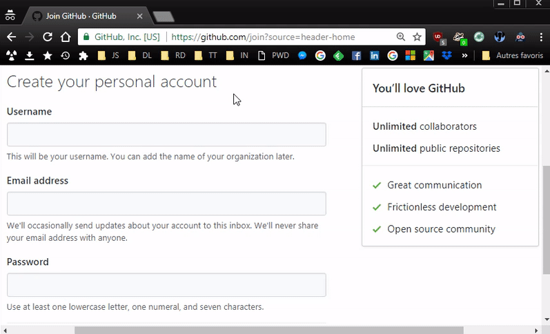

# PWD Hasher

## About
[Bookmarklet](https://en.wikipedia.org/wiki/Bookmarklet) to quickly generate unique and complex passwords for any website from a master password.  
Relies on [CryptoJS](https://code.google.com/archive/p/crypto-js/) to hash (with [SHA-3](https://en.wikipedia.org/wiki/SHA-3) algorithm) your master password and website domain.

## License
PWD Hasher is released under the [BSD-3-Clause](https://opensource.org/licenses/BSD-3-Clause).
